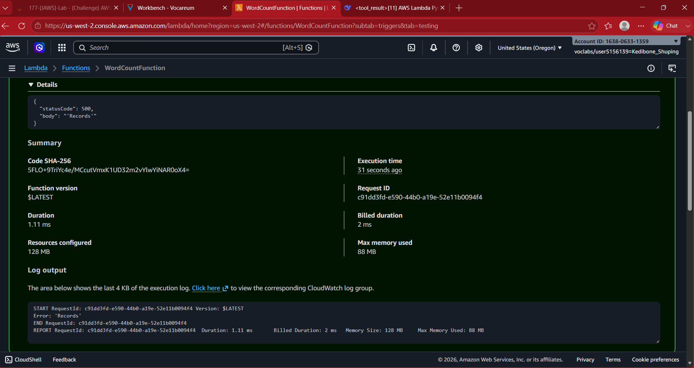
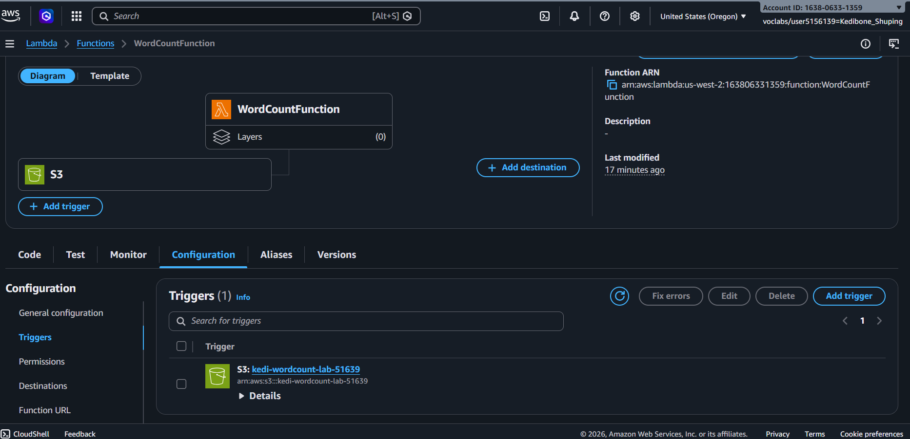
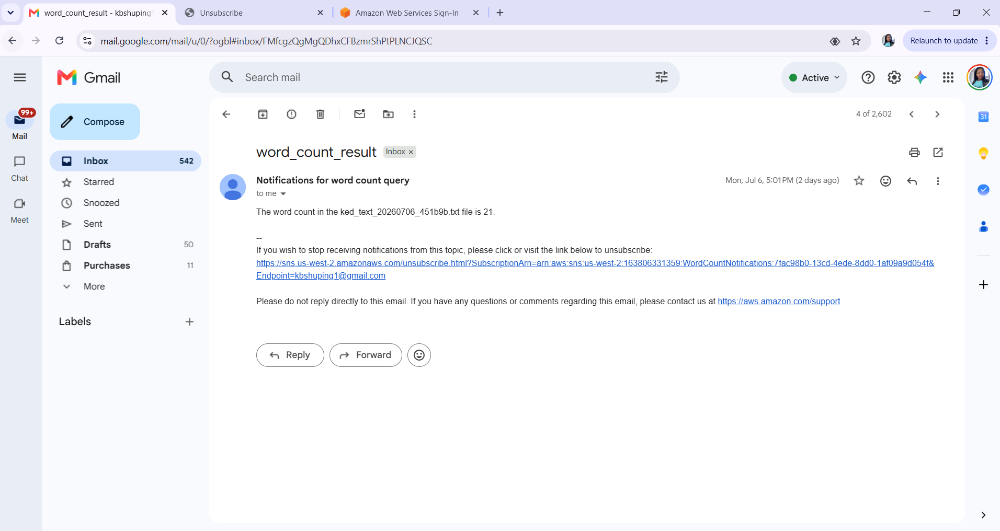

# AWS Lambda: Serverless Word Counter

## Project Overview

This project demonstrates how to build a serverless, event-driven application using AWS Lambda, Amazon S3, and Amazon SNS.

When a text file is uploaded to an Amazon S3 bucket, an AWS Lambda function is automatically triggered. The function reads the contents of the uploaded file, counts the number of words, and publishes the result to an Amazon SNS topic, which delivers the notification by email.

This project introduced the fundamentals of serverless computing and event-driven architecture while demonstrating how multiple AWS services can work together to automate a business process.

---

## Architecture

```text
User
   │
   ▼
Amazon S3 Bucket
   │
(Object Created Event)
   │
   ▼
AWS Lambda
   │
(Counts Words)
   │
   ▼
Amazon SNS
   │
   ▼
Email Notification
```

---

## AWS Services Used

- Amazon S3 – Stores uploaded text files and triggers the Lambda function.
- AWS Lambda – Processes uploaded files and counts the number of words.
- Amazon SNS – Sends the word count results to subscribed email recipients.
- AWS IAM – Manages the permissions required for Lambda to access Amazon S3 and Amazon SNS.
- Amazon CloudWatch Logs – Captures execution logs and supports troubleshooting.

---

## Project Workflow

1. Created an Amazon S3 bucket to store uploaded text files.
2. Created an Amazon SNS topic for email notifications.
3. Subscribed an email address to the SNS topic and confirmed the subscription.
4. Created an AWS Lambda function using the **Python 3.10** runtime.
5. Configured the Lambda execution role with the required IAM permissions.
6. Added the Python function to process uploaded text files.
7. Configured the Amazon S3 bucket to trigger the Lambda function whenever a new text file was uploaded.
8. Uploaded a sample text file to the S3 bucket.
9. Verified that the Lambda function automatically counted the words.
10. Confirmed that Amazon SNS successfully delivered the word count result by email.

---

## Skills Demonstrated

- Built and configured AWS Lambda functions
- Developed an event-driven serverless application
- Configured Amazon S3 event notifications
- Created and managed Amazon SNS topics and subscriptions
- Configured IAM execution roles and permissions
- Tested Lambda functions using S3 events
- Used Amazon CloudWatch Logs to investigate execution issues
- Integrated multiple AWS services into a complete serverless workflow

---

---

# Screenshots

## Lambda Function Code


The AWS Lambda function contains the Python code responsible for counting the number of words in an uploaded text file.

---

## Initial Function Test



The initial test exposed an issue that was identified and resolved during troubleshooting. CloudWatch logs were used to diagnose the problem before redeploying the function.

---

## Amazon S3 Trigger Configuration



The Lambda function is configured with an Amazon S3 event notification, automatically invoking the function whenever a new text file is uploaded to the bucket.

---

## Amazon SNS Email Notification



After successfully processing the uploaded file, the Lambda function publishes the word count to an Amazon SNS topic, which delivers the result via email.

---

## Challenges Encountered

During testing, the Lambda function successfully executed but returned a **500 Internal Server Error** instead of processing the uploaded file successfully.

### Investigation

To identify the cause of the issue, I:

- Reviewed the Lambda execution logs in Amazon CloudWatch.
- Verified the IAM permissions assigned to the Lambda execution role.
- Confirmed that the Amazon SNS email subscription had been activated.
- Verified that the Amazon S3 trigger was correctly configured.

### Resolution

The issue was caused by an error in the Lambda function logic while processing the incoming event data. After correcting the function code and redeploying the application, the Lambda function successfully processed uploaded files and Amazon SNS delivered the word count results by email.

---

## What I Learned

Through this project, I learned how to:

- Build event-driven serverless applications using AWS Lambda.
- Automatically trigger Lambda functions using Amazon S3 events.
- Send notifications using Amazon SNS.
- Configure IAM permissions for serverless applications.
- Use Amazon CloudWatch Logs to troubleshoot Lambda execution issues.
- Understand how AWS services integrate to automate business workflows.
