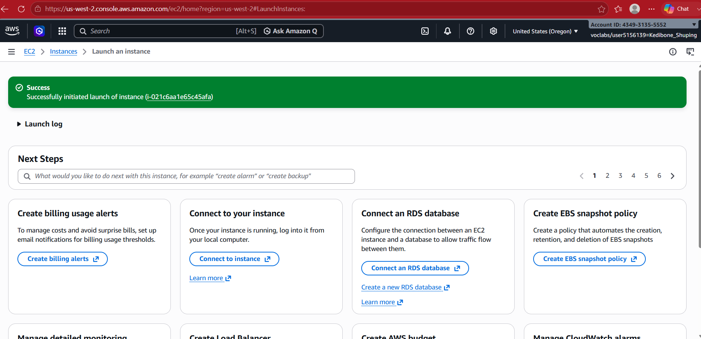
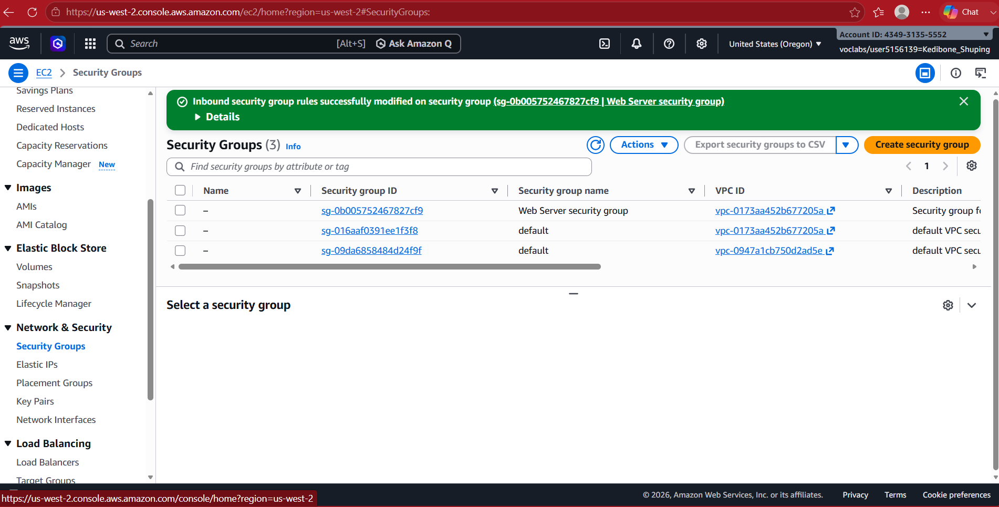
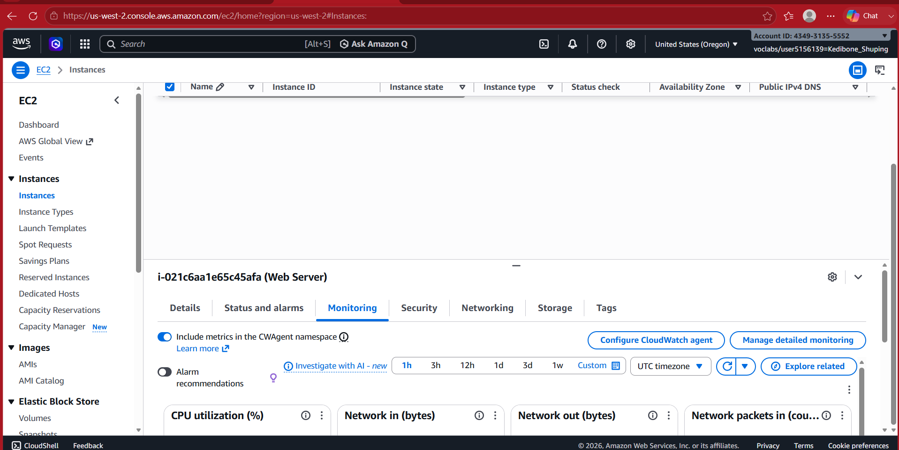
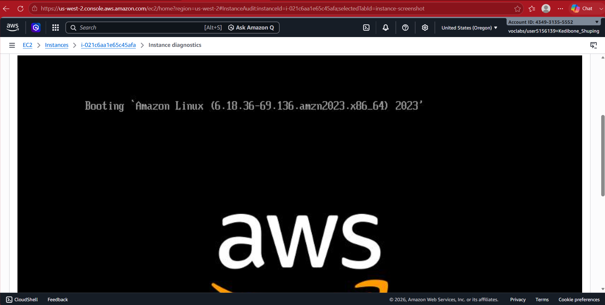
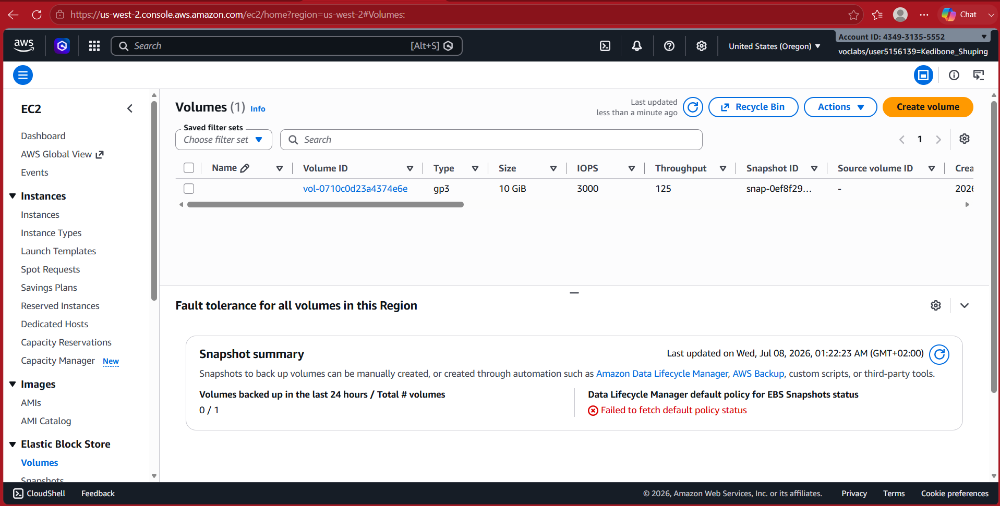
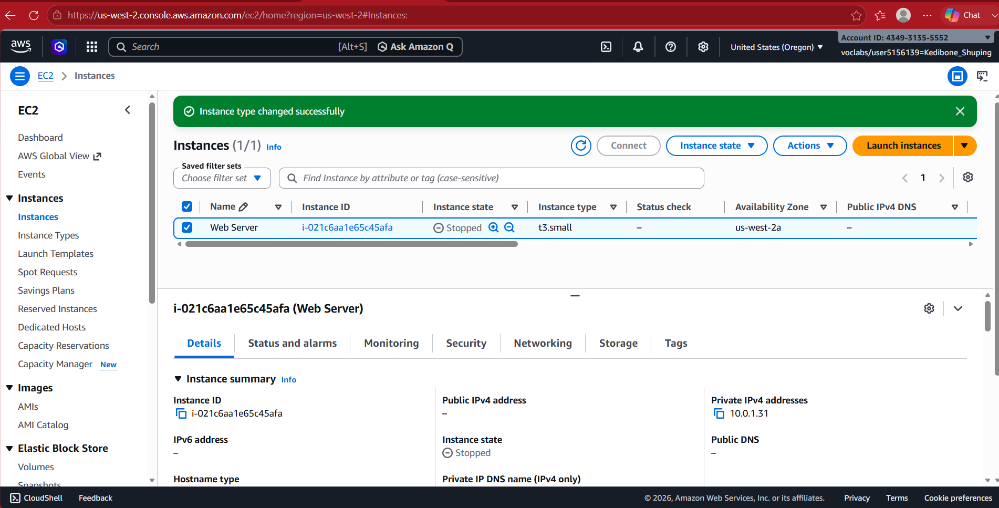
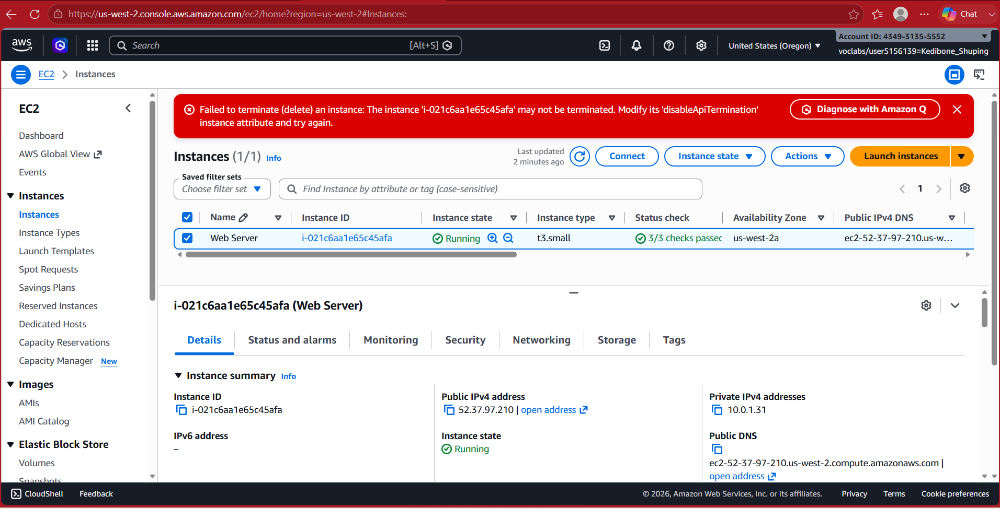
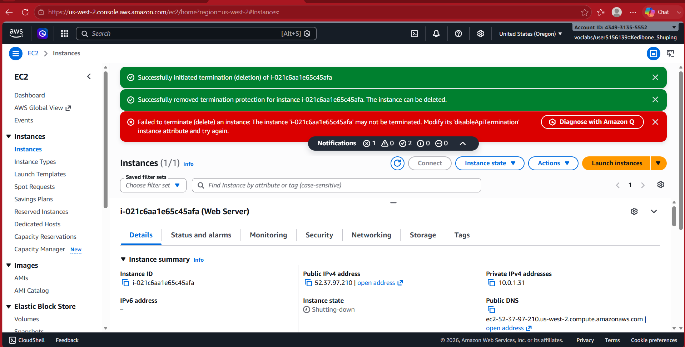

# Deploying and Managing an Amazon EC2 Web Server

## Project Overview

In this lab, I deployed an Amazon EC2 instance running Amazon Linux 2023 and configured it as a simple Apache web server using a User Data Bash script. I also monitored the instance, updated security settings, resized compute and storage resources, and tested termination protection.

---

## AWS Services Used

- Amazon EC2
- Amazon EBS
- Amazon VPC
- Security Groups
- Amazon Machine Image (AMI)
- Amazon CloudWatch

---

## Skills Demonstrated

- Launching an EC2 instance
- Selecting an Amazon Machine Image (AMI)
- Choosing an EC2 instance type
- Configuring Security Groups
- Configuring Amazon EBS storage
- Deploying Apache using User Data
- Monitoring EC2 health and status
- Allowing HTTP access through Security Groups
- Resizing an EC2 instance
- Expanding an Amazon EBS volume
- Enabling and testing termination protection

---

## Screenshots

### EC2 Instance Launched

### Security Group Updated

### EC2 Monitoring

### CloudWatch Instance Screenshot

### EBS Volume Resized

### EC2 Instance Type Changed

### Termination Protection Enabled

### EC2 Instance Terminated

## Outcome

Successfully deployed, monitored, secured, resized, and managed an Amazon EC2 web server while gaining hands-on experience with compute, networking, storage, and instance lifecycle management in AWS.
