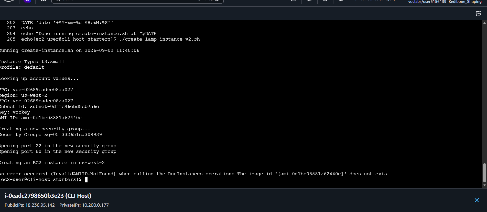
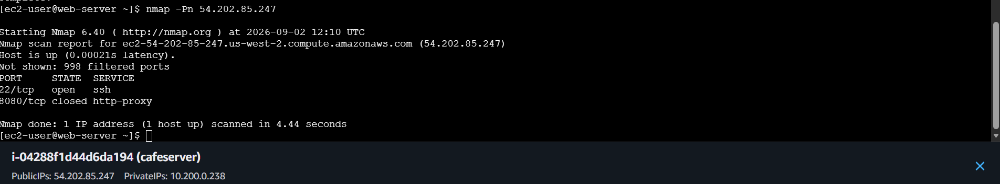
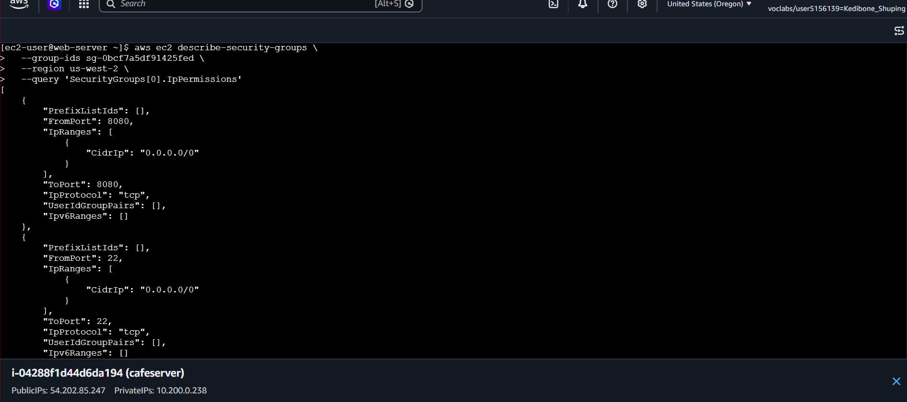
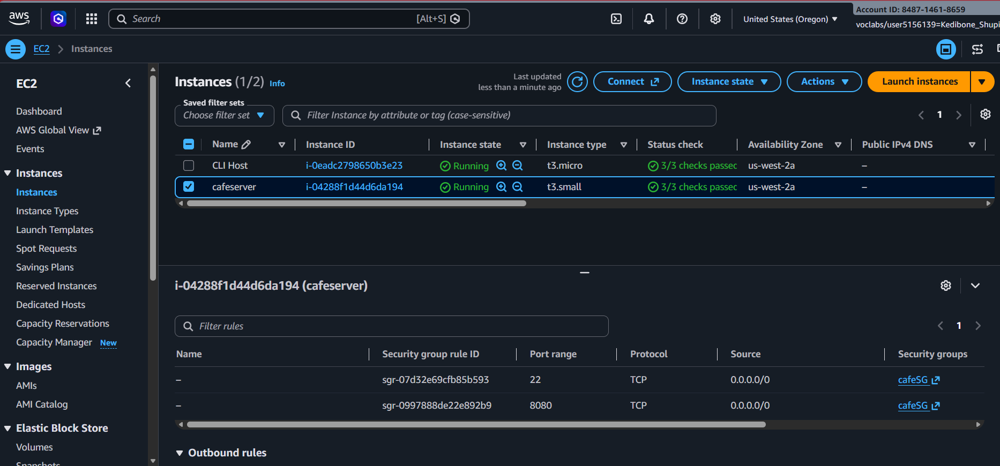
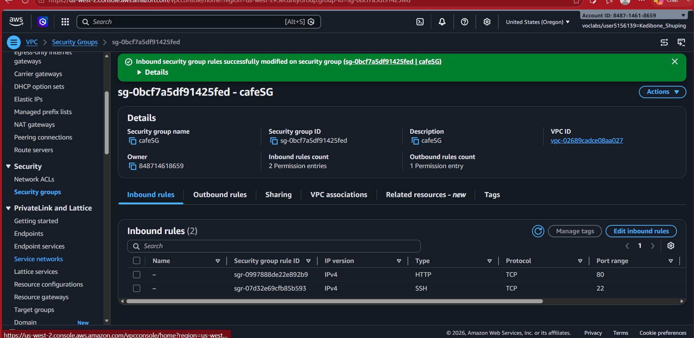
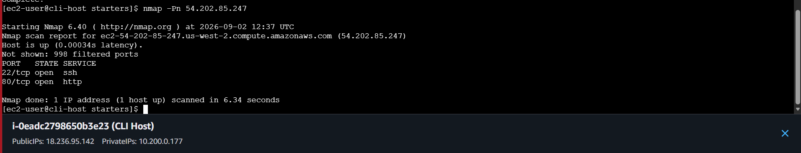
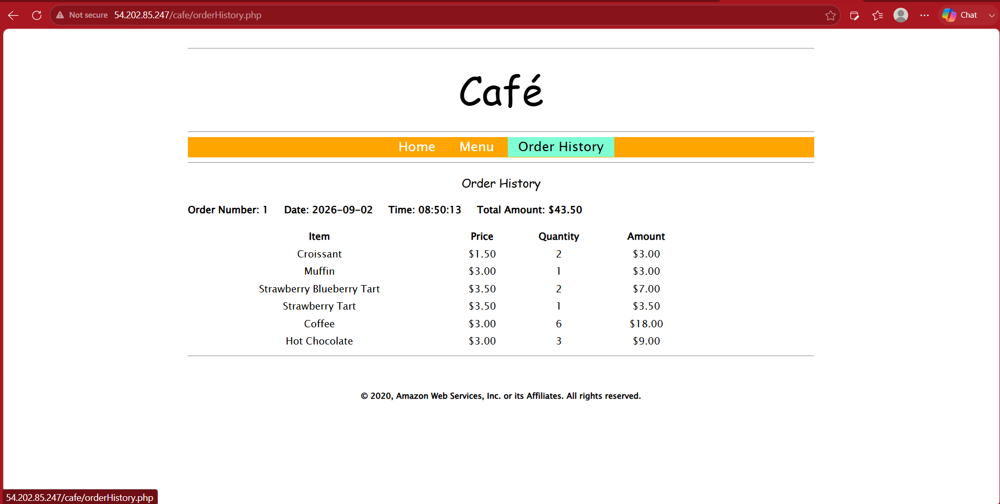

# Troubleshooting an EC2 Web Application

## Overview

In this lab, I troubleshot an AWS Café web application running on an Amazon EC2 instance. The investigation involved an EC2 launch failure, instance and security group validation, HTTP connectivity, and application-level verification.

I worked through the problems one at a time, checking the AWS configuration, network access, web server, and application until the Café site was working again.

## AWS Services and Tools Used

- Amazon EC2
- Amazon VPC
- Security Groups
- Amazon Machine Image (AMI)
- Apache HTTP Server
- AWS CLI
- Nmap

## Project Workflow

1. Investigated an EC2 launch failure caused by an AMI that was not valid in the selected AWS Region.
2. Corrected the launch configuration and successfully launched the web server.
3. Tested application access from a browser and identified that the lab application was being accessed over HTTP rather than HTTPS.
4. Validated the security group associated with the current EC2 instance instead of relying on a stale security group ID from an earlier run.
5. Inspected network access and HTTP connectivity using AWS CLI output and Nmap.
6. Verified the Apache/web application stack on the EC2 host.
7. Confirmed the Café application was functioning by loading the Order History page and retrieving stored order data.

## Technical Context

The main troubleshooting points were:

- **EC2:** The instance had to launch with an AMI available in the selected Region.
- **Networking:** The Security Group attached to the current instance had to allow the traffic required by the application.
- **Web server:** Apache had to be available on the EC2 host.
- **Application:** The Café application had to respond successfully and return its stored order information.

## Verification

The final application test successfully loaded the Café application's Order History page and displayed stored order information, confirming that the web application was reachable and functioning at the application level.

## Screenshots

### EC2 Launch Failure

The initial launch failed because the selected AMI was not valid in the selected Region.

### Network Diagnosis

Nmap showed that the host was reachable, but HTTP traffic was not yet available on port 80.

### Security Group Diagnosis

The AWS CLI was used to inspect the Security Group attached to the current instance and identify the inbound rule configuration.

### Security Group Console Cross-Check

The Security Group configuration was cross-checked in the AWS Console to confirm the CLI findings before applying the correction.

### Corrected HTTP Access

The inbound rule was corrected to allow HTTP traffic on port 80.

### Network Verification

A second Nmap test confirmed that port 80 was now open after the Security Group change.

### Application Verification

The Café application successfully loaded the Order History page and returned stored order information.

## Skills Demonstrated

- Troubleshooting EC2 launch failures
- Understanding AMI and AWS Region relationships
- Validating the resources actually attached to an EC2 instance
- Inspecting Security Group configuration using AWS CLI and the AWS Console
- Troubleshooting HTTP connectivity
- Using AWS CLI for resource investigation
- Using Nmap for network-level validation
- Checking a Linux web server and application stack
- Verifying an application through an end-to-end browser test
- Separating infrastructure, networking, operating system, and application-layer problems
