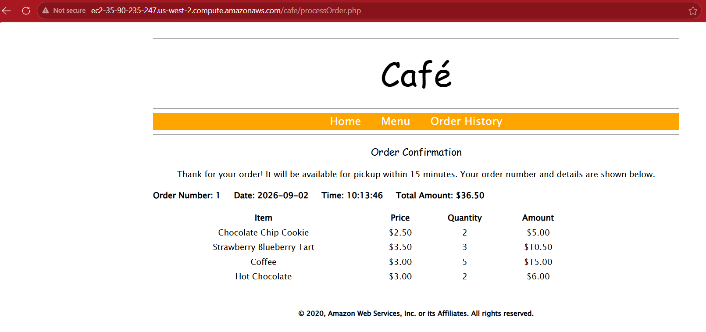
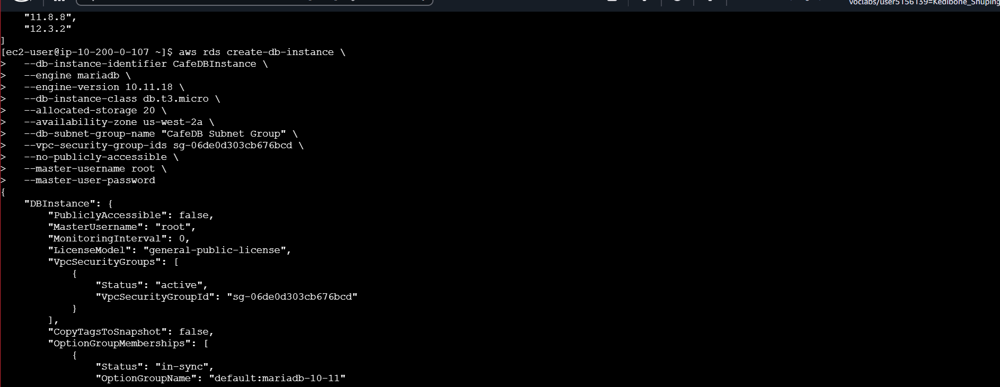
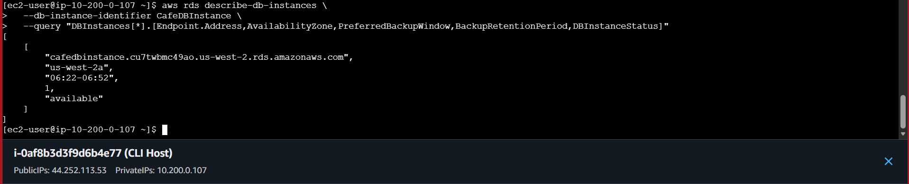
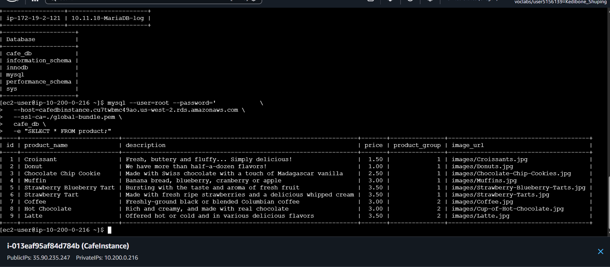
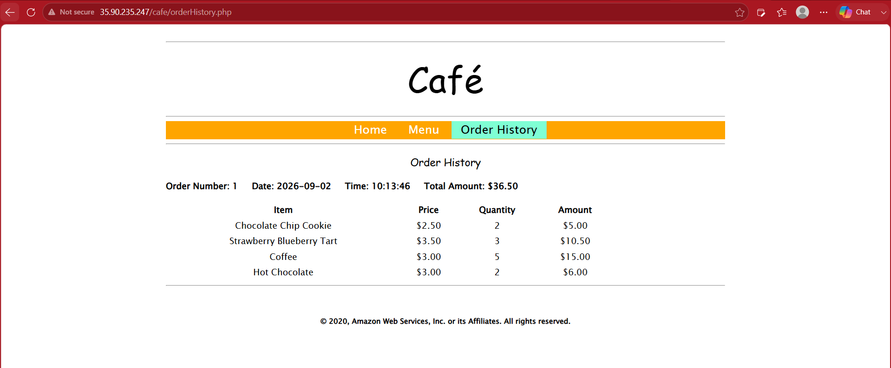

# Migrating to Amazon RDS

## Overview

In this lab, I migrated the Café web application's local MariaDB database from an Amazon EC2 instance to Amazon RDS for MariaDB. The migration included creating private database networking, restricting database access with a security group, transferring the existing database, repointing the application to RDS, and verifying the migrated data and application behavior.

The lab also required troubleshooting a MariaDB engine-version mismatch between the training instructions and the versions currently available in the AWS Region.

## AWS Services and Tools Used

- Amazon RDS for MariaDB
- Amazon EC2
- Amazon VPC
- Security Groups
- Amazon CloudWatch
- AWS Systems Manager Parameter Store
- AWS CLI
- MariaDB / MySQL client
- mysqldump

## Project Workflow

1. Created a pre-migration Café order to establish a data-integrity baseline.
2. Created a dedicated RDS database security group allowing TCP/3306 only from the Café EC2 security group.
3. Created two private subnets across `us-west-2a` and `us-west-2d` and placed them in an RDS DB subnet group.
4. Attempted to provision MariaDB 10.11.11 as specified by the lab, but AWS rejected the version because it was no longer available in the Region.
5. Queried AWS for the available MariaDB engine versions and selected MariaDB 10.11.18.
6. Provisioned a private RDS MariaDB instance using the DB subnet group and database security group.
7. Created a SQL dump of the local `cafe_db` database and restored it into RDS over a TLS-verified connection.
8. Queried the RDS database to verify the migrated product data.
9. Updated the `/cafe/dbUrl` Systems Manager Parameter Store value so the Café application pointed to the RDS endpoint.
10. Verified that the Café application could still retrieve the original order after the database cutover.
11. Used CloudWatch `DatabaseConnections` to observe database connection activity.
12. Ended the temporary lab environment and initiated resource termination.

## Technical Context

### Before migration

```text
Café EC2
├── Web application
└── Local MariaDB
    └── cafe_db
```

### After migration

```text
Café EC2
└── Web application
        │
        │ MariaDB connection
        ▼
   RDS MariaDB
   └── cafe_db
```

The RDS instance was configured as private (`PubliclyAccessible: false`) and associated with a dedicated database security group. The DB subnet group contained private subnets in two Availability Zones: `us-west-2a` and `us-west-2d`. This subnet-group configuration should not be confused with a Multi-AZ DB deployment; the instance itself was not configured as Multi-AZ.

## Troubleshooting

The lab instructions specified MariaDB engine version `10.11.11`, but the AWS CLI returned:

```text
InvalidParameterCombination: Cannot find version 10.11.11 for mariadb
```

Instead of guessing, I queried the Region for the available MariaDB engine versions. MariaDB 10.11.18 was available, so I retained the intended 10.11 engine family and used 10.11.18 for the RDS instance.

This demonstrated the difference between following a training instruction literally and validating configuration against the current AWS environment.

## Verification

The migration was verified at multiple layers:

- The RDS instance reached `available` status and provided an endpoint.
- `cafe_db` was present on RDS after the restore.
- The migrated `product` table returned its application data from RDS.
- The Café application's Order History continued to display the original order after the application endpoint was changed to RDS.
- CloudWatch `DatabaseConnections` reflected active database connection activity.

## Screenshots

### Pre-Migration Order Baseline



The original Café order was recorded before migration so that the same data could be verified after the application was repointed to RDS.

### RDS Instance Created



The RDS instance was created as a private MariaDB 10.11.18 instance using the dedicated database security group and DB subnet group.

### RDS Instance Available



The RDS instance reached `available` status and returned its endpoint, confirming that the managed database was ready for migration work.

### Database Migration Verified



The `product` table was queried through the RDS endpoint and returned the migrated Café product catalogue.

### Application Verification



After updating the application's database endpoint, Order History still returned the original order, demonstrating application-level continuity after the database cutover.

### CloudWatch Monitoring


CloudWatch `DatabaseConnections` was observed with a one-minute period while an interactive MariaDB connection was opened and then closed.

## Skills Demonstrated

- Migrating a relational database from EC2-hosted MariaDB to Amazon RDS
- Designing private database network placement
- Using security-group-to-security-group access control
- Working with RDS DB subnet groups and Availability Zones
- Provisioning RDS with the AWS CLI
- Troubleshooting AWS configuration/version drift
- Using `mysqldump` for database migration
- Establishing TLS-verified database connections
- Verifying data integrity after migration
- Updating application configuration through Systems Manager Parameter Store
- Validating application behavior after a database cutover
- Using CloudWatch metrics for operational monitoring
- Evidence-based troubleshooting and verification
