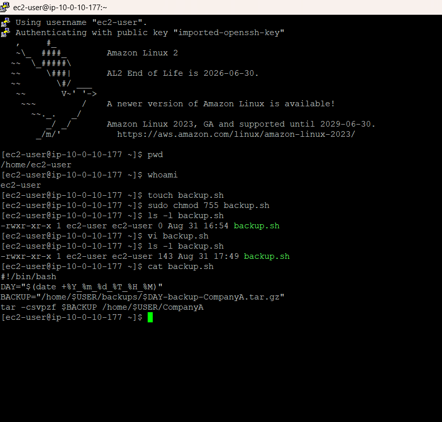
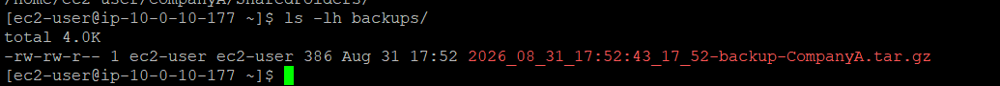
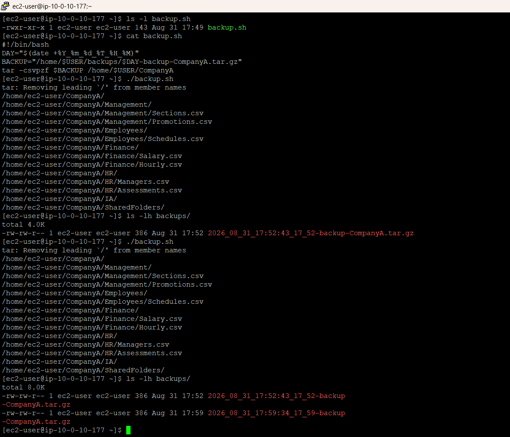
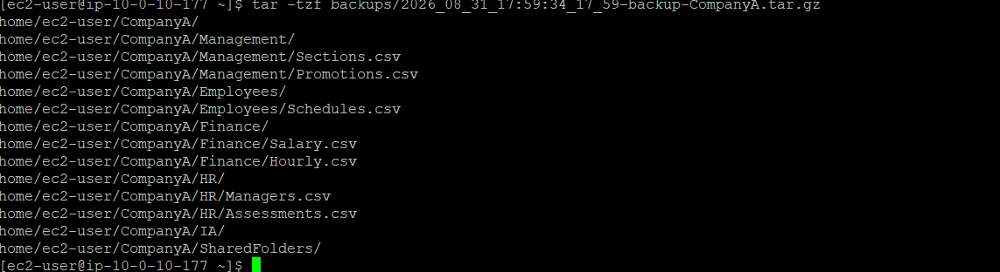

# Bash Shell Scripts

## Overview

This lab focused on using Bash to automate the creation of a compressed backup of the `CompanyA` directory on an Amazon Linux EC2 instance.

I created an executable Bash script that generates a timestamped backup filename, builds the archive with `tar`, and stores the resulting `.tar.gz` file in the `backups` directory.

## AWS Services and Tools Used

- Amazon EC2
- Amazon Linux
- SSH
- Bash
- `tar` and gzip

## Project Workflow

1. Connected to the Amazon Linux EC2 instance using SSH.
2. Created an empty `backup.sh` file and made it executable with `chmod 755`.
3. Built the Bash script with a shebang, a timestamp variable, a dynamically constructed backup path, and a `tar` command.
4. Executed the script to create a compressed backup of the `CompanyA` directory.
5. Verified that the generated `.tar.gz` archive existed in the `backups` directory.
6. Ran the script a second time and verified that a second timestamped archive was created without replacing the first.
7. Inspected the contents of the archive with `tar -tzf` without extracting it.

## Technical Context

The script uses Bash command substitution to obtain the current date and time and stores that value in `DAY`. The value is then used to construct the destination path stored in `BACKUP`.

The backup operation uses `tar` with gzip compression to package the `CompanyA` directory into a `.tar.gz` archive. Because the filename includes a timestamp, each execution creates a new destination filename based on the time of execution.

The lab also introduced the idea that this type of script could be scheduled with `cron` for recurring backups, although scheduling was outside the scope of the exercise.

## Verification

The first execution produced a timestamped archive in the `backups` directory. The observed archive was 386 bytes.

A second execution produced another 386-byte archive with a different timestamped filename, while the first archive remained present. This verified the behavior of the script when run more than once.

The archive contents were then listed with:

```bash
tar -tzf backups/<backup-file>.tar.gz
```

The listing showed the `CompanyA` directory structure and its files without extracting the archive.

## Evidence

### 1. Backup Script

The completed `backup.sh` script shows the shebang, timestamp generation, dynamic backup path, and archive creation command.



### 2. Backup Archive Created

The generated `.tar.gz` archive is visible in the `backups` directory after the first execution.



### 3. Repeatable Backup Execution

The script was executed a second time, producing a second timestamped archive while the original remained in place.



### 4. Backup Archive Contents

The contents of the generated archive were inspected with `tar -tzf`, confirming that the `CompanyA` directory structure was included.



## Skills Demonstrated

- Connected to an Amazon Linux EC2 instance using SSH
- Created and configured an executable Bash script
- Used Bash variables and command substitution
- Constructed dynamic file paths using environment variables
- Created compressed `tar.gz` archives
- Verified generated backup artifacts from the command line
- Tested repeatable script execution and observed timestamp-based file naming
- Inspected archive contents without extracting the archive
