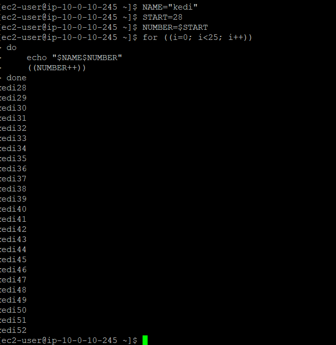
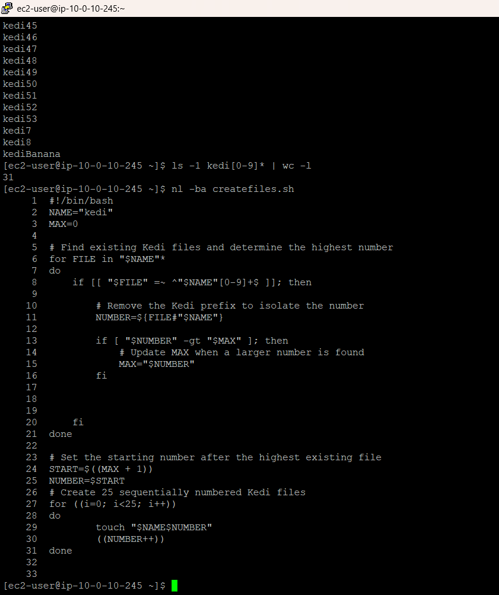
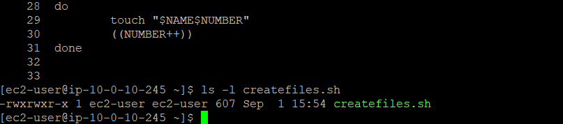

# Lab 253 — Challenge: Bash Shell Scripting

## Overview

This lab focused on using Bash to create a sequence of numbered files while taking the files already in the directory into account.

Instead of choosing a starting number manually, I built the script so it could look at the existing `kedi<number>` files, find the highest number, and continue the sequence from there.

## What I Built

I created an executable Bash script called `createfiles.sh`.

The script:

1. Looks for existing files beginning with `kedi`.
2. Uses a regular expression to make sure the filename has a numeric suffix.
3. Extracts the number from each matching filename.
4. Keeps track of the highest number found.
5. Uses the next number as the starting point.
6. Creates 25 files in sequence with a C-style `for` loop.

The file creation itself is handled with `touch`, while the number is incremented after each file is created.

## Verification

Before the final run, I tested the loop with `START=28`. It created the sequence from `kedi28` through `kedi52`, giving 25 files.

For the final run, the script detected the existing sequence and continued from the next available number, creating files through `kedi53`.

I verified the resulting files with:

```bash
ls -1 kedi[0-9]* | wc -l
```

The command returned `31`.

I also checked the script syntax with:

```bash
bash -n createfiles.sh
```

No syntax errors were reported. The script's executable permissions were also verified before finishing the lab.

## Key Bash Concepts

- Variables and variable expansion
- Regular-expression matching with `=~`
- Parameter expansion
- Arithmetic and increment operators
- Conditional logic
- C-style `for` loops
- `touch` for file creation
- Filesystem state discovery
- Script permissions
- Command-line verification

## What I Learned

The part I found most useful in this lab was making the script respond to what was already in the directory. The starting number wasn't hard-coded; the script had to discover the current state first and then work out where the next sequence should begin.

That was a good reminder that there is a difference between writing a command that works once and writing a script that can adapt when the environment has already changed.

## Screenshots

### 1. File Creation Sequence

The controlled test created 25 files from `kedi28` through `kedi52`.



### 2. Final Execution and Verification

The final run continued the sequence through `kedi53`, and the resulting directory contained 31 numbered files.



### 3. Script Permissions

The script's executable permissions were verified before the lab was completed.


