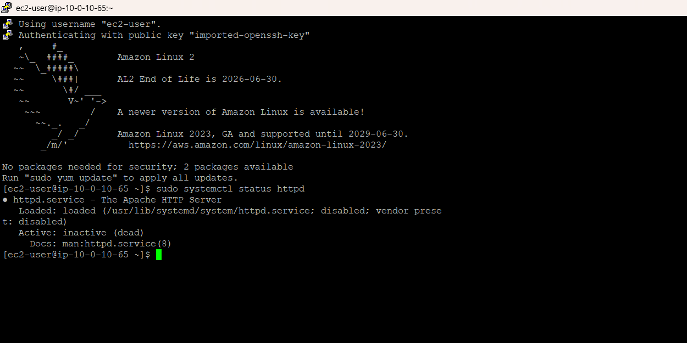
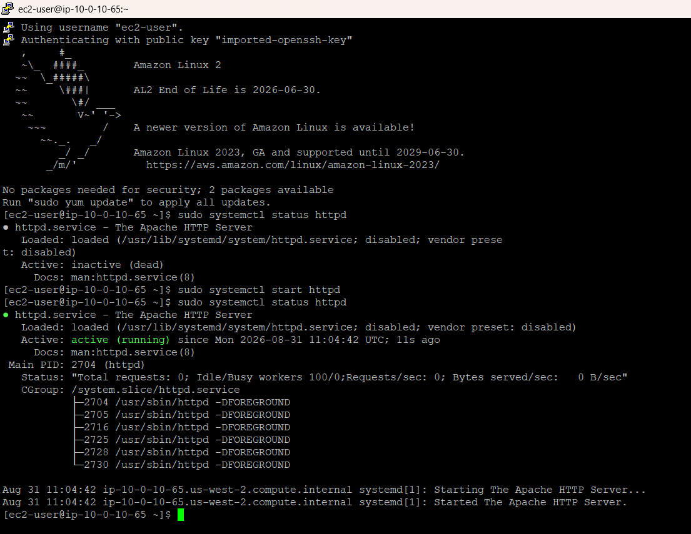
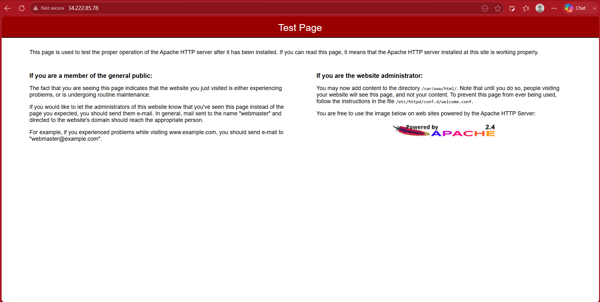
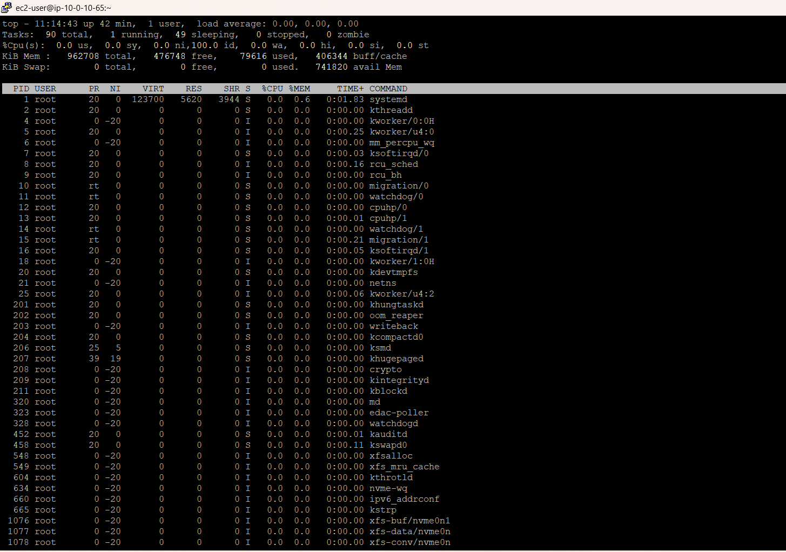
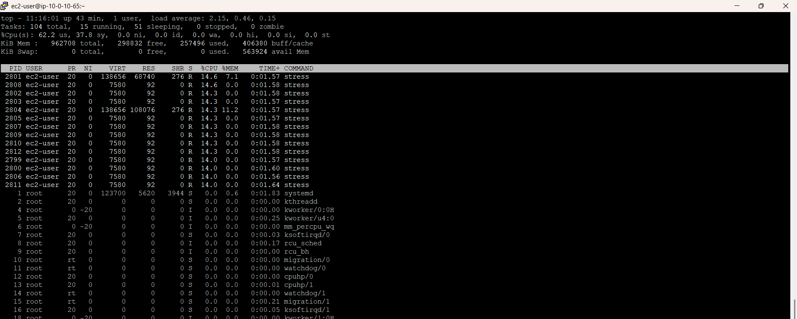
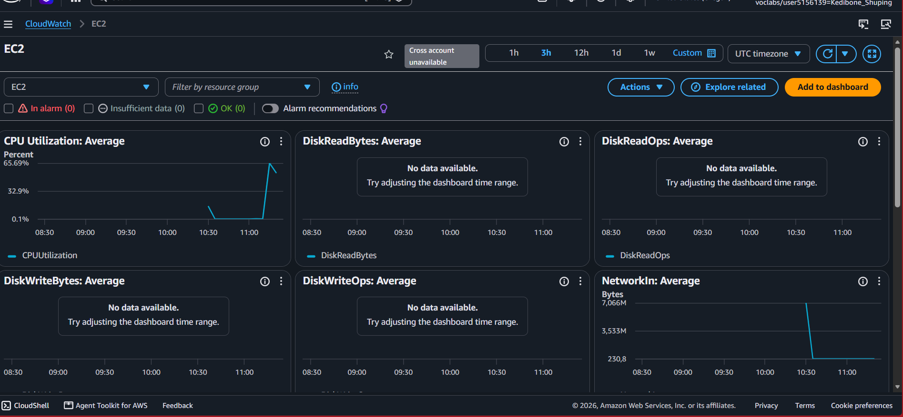

# Managing Linux Services and Monitoring

## Overview

This lab focused on managing a Linux service on an Amazon EC2 instance and using both Linux and AWS tools to monitor system activity.

I worked with the Apache HTTP Server (`httpd`), used `systemctl` to manage the service, used `top` to monitor processes and CPU usage, and then used Amazon CloudWatch to observe the same CPU workload from the AWS side.

## AWS Services and Components Used

- Amazon EC2
- Amazon CloudWatch
- Amazon Linux
- Apache HTTP Server (`httpd`)
- `systemctl`
- `top`

## Project Workflow

1. Connected to an Amazon Linux EC2 instance using SSH.
2. Checked the initial status of the Apache HTTP Server.
3. Started the `httpd` service with `systemctl`.
4. Verified that Apache was running by opening the instance's public IP address in a browser.
5. Used `top` to establish a baseline for CPU and process activity.
6. Ran the provided `stress.sh` script to generate a temporary CPU workload.
7. Used `top` to observe the processes responsible for the increased CPU usage.
8. Opened the EC2 automatic dashboard in Amazon CloudWatch and observed the resulting CPU utilization spike.
9. Waited for the workload to finish and observed CPU utilization return toward its normal level.
10. Stopped the Apache service as part of the lab cleanup.

## Technical Context

### Managing the Apache service

The Apache HTTP Server was already installed on the instance, but it was initially inactive. I used `systemctl` to check and manage its state.

```bash
sudo systemctl status httpd.service
sudo systemctl start httpd.service
sudo systemctl stop httpd.service
```

The initial status showed the service as `inactive (dead)`. After starting it, the status changed to `active (running)`.

I then opened the EC2 instance's public IP address in a browser and received the Apache HTTP Server test page. This provided a practical check that the service was not only running but also responding to HTTP requests.

One useful distinction from this exercise was the difference between **starting** and **enabling** a service. Starting `httpd` made it run immediately. Enabling a service controls whether it is configured to start automatically when the system boots. These are separate operations.

### Monitoring processes with `top`

I used `top` to look at the instance before and during a controlled workload.

The initial view showed the instance largely idle, with CPU usage at approximately 0%.

I then ran:

```bash
./stress.sh & top
```

The `stress` processes appeared near the top of the process list and CPU usage increased substantially. The captured `top` output showed the `stress` processes consuming CPU, with approximately 62.2% CPU usage in user space and 0.0% CPU idle.

This was useful because `top` showed more than just a CPU percentage. It showed **which processes were responsible for the increase**.

### Monitoring the same event with CloudWatch

After generating the workload, I opened the EC2 automatic dashboard in Amazon CloudWatch.

The CPU Utilization graph showed a clear spike, reaching approximately 65.69%, followed by a decline after the workload finished.

The values shown by `top` and CloudWatch were not identical, but both showed the same underlying CPU workload: a sharp increase followed by a return toward normal levels. The important result was that the CPU workload observed inside Linux was also visible as a measurable event in CloudWatch.

This gave me a useful view of the same system from two levels:

```text
Linux processes
      ↓
CPU workload
      ↓
EC2 resource usage
      ↓
CloudWatch CPU Utilization
```

## Evidence

The evidence from this lab is based on the actual service states, process activity, and CloudWatch metrics observed during the exercise. Screenshots were captured selectively rather than documenting every step of the lab.

### Apache Service — Initial State

`systemctl status httpd.service` showed the Apache service as `inactive (dead)` before it was started.



### Apache Service — Running

After starting the service, `httpd` reported `active (running)`.



### Apache Test Page

The Apache HTTP Server test page was successfully returned when the EC2 instance's public IP address was opened in a browser, confirming that the web server was responding.



### CPU Monitoring — Baseline

Before generating the workload, `top` showed the instance largely idle. This established a baseline for comparison with the workload state.



### CPU Workload Observed with `top`

During the controlled workload, `top` showed multiple `stress` processes consuming CPU. The captured observation showed approximately 62.2% CPU usage in user space and 0.0% CPU idle.



### CloudWatch CPU Utilization

The EC2 CloudWatch dashboard showed the corresponding CPU utilization spike, reaching approximately 65.69%, followed by a decline after the workload completed.



## Skills Demonstrated

- Connected to an Amazon Linux EC2 instance using SSH
- Managed Linux services with `systemctl`
- Started and stopped the Apache HTTP Server
- Verified a web service from an EC2 public IP address
- Monitored Linux processes with `top`
- Identified CPU-intensive processes
- Generated a controlled CPU workload
- Monitored EC2 metrics with Amazon CloudWatch
- Correlated host-level process activity with AWS monitoring data
- Used observed system behaviour as troubleshooting evidence

## Key Lessons Learned

- A service can be installed and loaded without currently running.
- `systemctl start` and `systemctl enable` perform different jobs.
- `top` is useful for identifying the processes behind changes in resource usage.
- CloudWatch provides an AWS-level view of resource activity on an EC2 instance.
- Looking at the same event from both the operating-system and AWS monitoring layers makes troubleshooting easier to understand.
