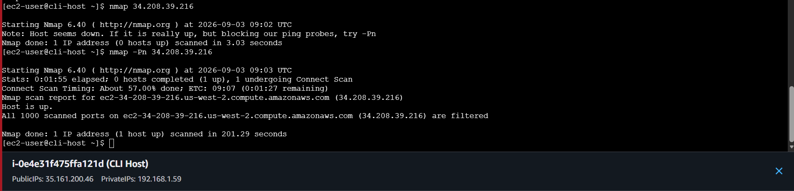
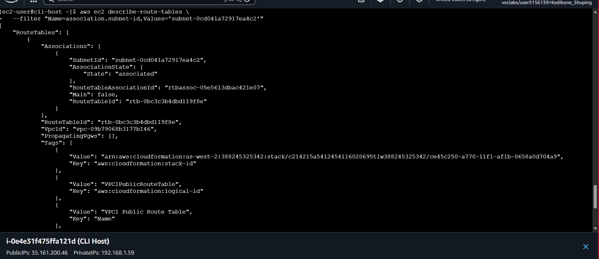
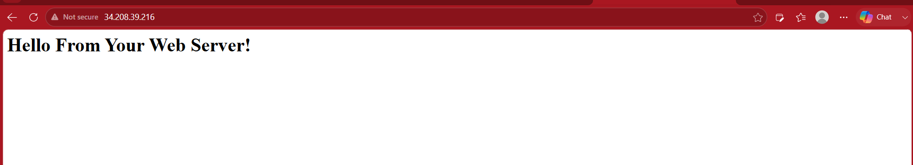
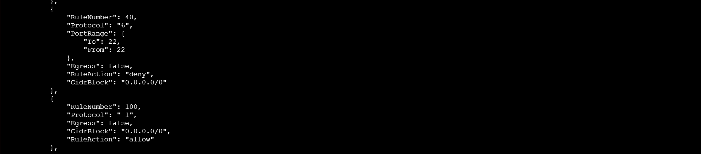
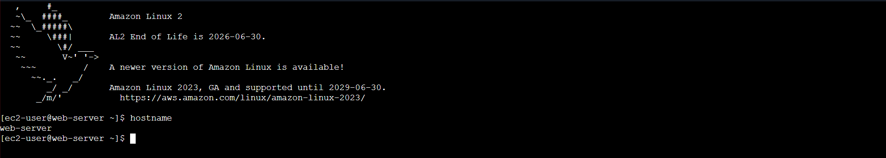
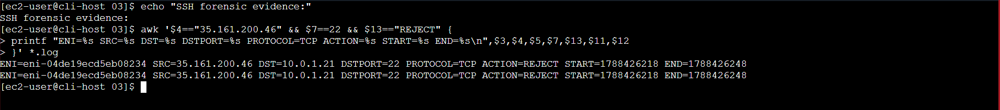

# VPC Troubleshooting and Network Forensics

## Overview

This project demonstrates how to troubleshoot VPC connectivity problems by following network traffic through the AWS networking stack and using VPC Flow Logs to investigate rejected traffic.

During the exercise, I diagnosed two connectivity failures affecting an EC2 web server. The first prevented HTTP access because the public subnet was missing a route to the Internet Gateway. The second prevented SSH access because a Network ACL explicitly denied TCP port 22. I then used VPC Flow Logs to correlate the failed SSH connection with the network configuration and verify the diagnosis.

## AWS Services and Components Used

- Amazon VPC
- Amazon EC2
- VPC Flow Logs
- Amazon S3
- Internet Gateway
- Route Tables
- Network ACLs
- Security Groups
- AWS CLI

## Project Workflow

1. Connected to the CLI Host and configured the AWS CLI for the lab environment.
2. Created an Amazon S3 bucket to receive VPC Flow Logs.
3. Enabled VPC Flow Logs and verified that log delivery was active and successful.
4. Investigated failed HTTP access to the EC2 web server using network testing and VPC configuration.
5. Identified and repaired the missing default route to the Internet Gateway.
6. Verified that HTTP access to the web server was restored.
7. Investigated the remaining SSH connectivity failure by examining the subnet Network ACL.
8. Identified and removed the explicit TCP/22 deny rule.
9. Verified SSH access by connecting to the web server and confirming the remote hostname.
10. Retrieved the VPC Flow Logs from Amazon S3 and analyzed rejected TCP/22 traffic.
11. Correlated the rejected flow with the web server's network interface and the Network ACL configuration.

## Technical Context

A VPC connection depends on several networking controls working together. Route tables determine where traffic is sent, while Network ACLs and Security Groups control whether traffic is permitted at the subnet and instance levels.

For the web server's public connectivity, the associated subnet route table contained the VPC local route but no default route to the Internet Gateway. Although the Security Group allowed inbound HTTP and SSH traffic, there was no routing path for Internet-bound traffic.

After HTTP access was restored, SSH remained unavailable. The subnet Network ACL contained an explicit inbound deny for TCP port 22. Because Network ACL rules are evaluated in ascending rule-number order, the deny rule matched before the later broad allow rule.

VPC Flow Logs provided another view of the problem. They recorded the source, destination, ports, protocol, action, and network interface associated with the traffic. This allowed the rejected SSH connection to be correlated with the affected EC2 instance and the NACL configuration.

## Troubleshooting and Analysis

### HTTP Connectivity

The first test with `nmap` reported that the host appeared to be down. Repeating the test with `nmap -Pn` showed that the host was reachable, but the scanned ports were filtered.

I first examined the Security Group because TCP/80 access was failing. The Security Group already permitted inbound TCP/80 and TCP/22, so the next layer in the packet path was the subnet routing configuration.

The public subnet route table was missing the default route to the Internet Gateway. I added the route:

```bash
aws ec2 create-route \
  --route-table-id rtb-0bc3c3b4dbd119f8e \
  --destination-cidr-block 0.0.0.0/0 \
  --gateway-id igw-041b735629c399b76
```

The web server then became reachable over HTTP and returned `Hello From Your Web Server!`.

### SSH Connectivity

With HTTP restored, SSH access was tested separately. The Network ACL associated with the subnet contained an explicit inbound rule denying TCP port 22 from `0.0.0.0/0`.

I removed the offending rule:

```bash
aws ec2 delete-network-acl-entry \
  --network-acl-id acl-07db8c039c58ab5c3 \
  --rule-number 40 \
  --ingress
```

SSH access was then restored. The connection was verified from the web server with:

```text
[ec2-user@web-server ~]$ hostname
web-server
```

### VPC Flow Log Analysis

After retrieving the Flow Logs from Amazon S3, I initially used a broad search for `22`. This produced false positives because the value could appear inside unrelated port numbers and other fields.

I refined the search to the exact destination-port and action fields:

```bash
awk '$7 == 22 && $13 == "REJECT" {print}' *.log
```

The relevant records showed TCP/22 connection attempts from the CLI Host to the web server:

```text
2 388245325342 eni-04de19ecd5eb08234 35.161.200.46 10.0.1.21 44376 22 6 1 60 1788426218 1788426248 REJECT OK
2 388245325342 eni-04de19ecd5eb08234 35.161.200.46 10.0.1.21 44382 22 6 1 60 1788426218 1788426248 REJECT OK
```

The flow showed:

- Source: `35.161.200.46` — CLI Host
- Destination: `10.0.1.21` — Web Server private IP
- Destination port: `22`
- Protocol: TCP (`6`)
- Action: `REJECT`
- Network interface: `eni-04de19ecd5eb08234`
- Time window: `09:03:38–09:04:08 UTC`

I then correlated the network interface with its EC2 instance using the AWS CLI. The interface belonged to the web server at `10.0.1.21`.

The Flow Log did not identify Network ACL Rule 40 by itself. The root cause was established by combining the observed `REJECT` records with the NACL configuration, removing the matching deny rule, and successfully repeating the SSH connection.

## Packet Path

```text
CLI Host
  │
  │ TCP/22
  ▼
Web Server ENI
  │
  └── Network ACL → Rule 40 DENY
                    ↓
                 REJECT

After removing Rule 40:

CLI Host
  │
  │ TCP/22
  ▼
Web Server ENI
  │
  └── Network ACL → traffic permitted
                    ↓
                 SSH succeeds
```

## Screenshots

### Initial Connectivity Testing

The initial `nmap` results showed the difference between failed host discovery and a reachable host with filtered ports.



---

### Missing Internet Gateway Route

The public subnet route table showed the VPC local route but no default route to the Internet Gateway.



---

### HTTP Access Restored

After the routing path was repaired, the web server became reachable over HTTP.



---

### Network ACL Blocking SSH

The subnet Network ACL contained an explicit inbound deny for TCP/22. The lower rule number caused the deny to match before the later allow rule.



---

### SSH Access Restored

Removing the offending NACL rule restored SSH access to the web server.



---

### Flow Log Analysis

The Flow Log records captured the relevant CLI Host to Web Server TCP/22 attempts as `REJECT`, supporting the diagnosis of the failed SSH connection.



## Skills Demonstrated

- Troubleshot VPC connectivity using layered network reasoning
- Diagnosed route table configuration problems
- Configured Internet Gateway routing for public subnet connectivity
- Analyzed Network ACL rule evaluation and stateless filtering
- Distinguished the roles of Route Tables, Network ACLs, and Security Groups
- Created and verified VPC Flow Logs
- Retrieved and analyzed Flow Log data from Amazon S3
- Used AWS CLI for network investigation and resource correlation
- Refined diagnostic searches to avoid false positives
- Correlated network telemetry with AWS resource configuration
- Verified remediation through successful network connectivity tests
