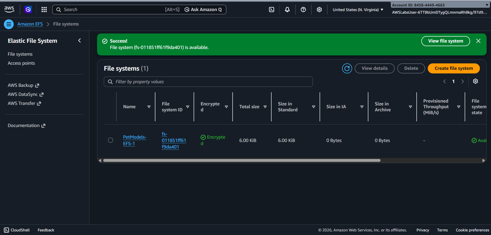
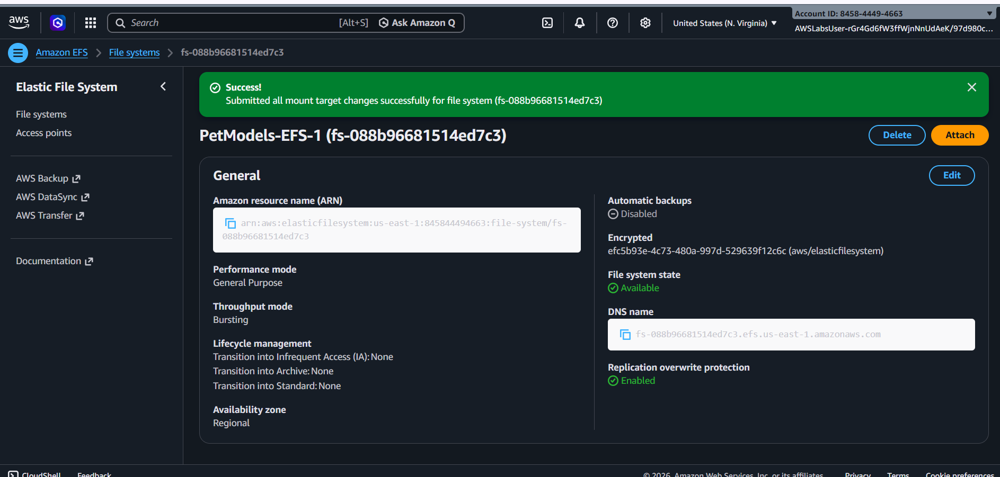
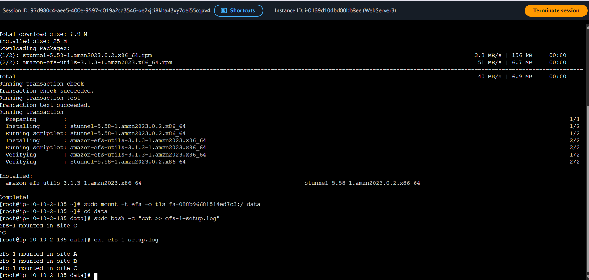

# Amazon EFS Shared File Storage

## Overview

This project demonstrates how to create and configure Amazon Elastic File System (EFS) and mount it to multiple Amazon EC2 instances.

Amazon EFS provides shared file storage that can be accessed by multiple EC2 instances over the network using NFS. During the exercise, I created an EFS file system, configured mount targets across multiple sites, installed the Amazon EFS utilities on Linux, mounted the file system, and verified access from multiple instances.

## Training Evidence

**AWS SimuLearn:** File Systems in the Cloud  
**Completed:** July 7, 2026

[View AWS Completion Certificate](../../../Certifications/aws-simulearn-file-systems-in-the-cloud-certificate.pdf)

## AWS Services and Components Used

- Amazon EFS
- Amazon EC2
- Amazon VPC
- Security Groups
- EFS Mount Targets
- Amazon Linux
- NFS

## Project Workflow

1. Created an Amazon EFS file system.
2. Configured mount targets in multiple Availability Zones/sites.
3. Configured network access for NFS traffic (TCP port 2049).
4. Connected to EC2 instances using EC2 Instance Connect.
5. Installed the Amazon EFS utilities on Linux.
6. Mounted the EFS file system to a local directory.
7. Verified that the EFS file system was successfully mounted.
8. Verified that the shared file system was accessible across multiple sites/instances.

## Technical Context

Amazon EFS provides shared network file storage that can be accessed by multiple EC2 instances. Unlike block storage attached to an individual instance, the same EFS file system can be accessed by multiple clients over the VPC using NFS.

EFS mount targets provide network access to the file system within the Availability Zones where clients connect. In the exercise, I worked with the Linux side of this setup by installing the EFS utilities, mounting the file system, and validating the mount from the EC2 instances.

## Evidence

The screenshots below highlight the key configuration and validation steps from the completed SimuLearn exercise.

### 1. Amazon EFS File System Created

Created the `PetModels-EFS-1` file system used for the exercise.

---

### 2. EFS Mount Targets Created

Configured EFS mount targets to provide network access to the file system from the VPC.

---

### 3. EFS Mounted on an EC2 Instance

Installed the Amazon EFS utilities on Linux and mounted the file system on an EC2 instance.

---

### 4. EFS Mounted Across Multiple Sites

Verified that the same EFS file system was mounted and accessible from Sites A, B, and C.

## Skills Demonstrated

- Configured shared network storage using Amazon EFS
- Created and configured EFS mount targets
- Configured Security Groups for NFS communication
- Installed EFS utilities on Linux
- Mounted network file systems on Linux
- Connected multiple EC2 instances/sites to shared storage
- Used Linux commands to validate mounted file systems
- Interpreted how EFS provides shared storage to networked compute resources
