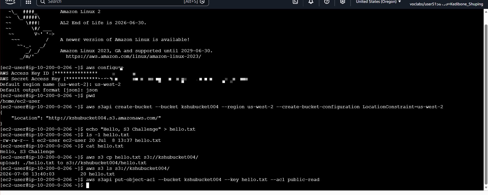
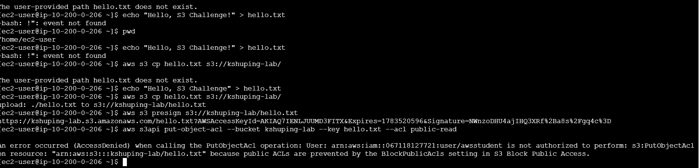
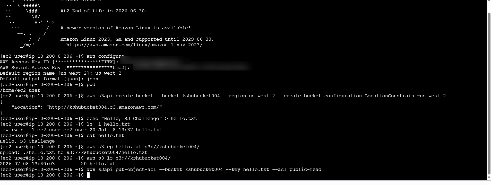
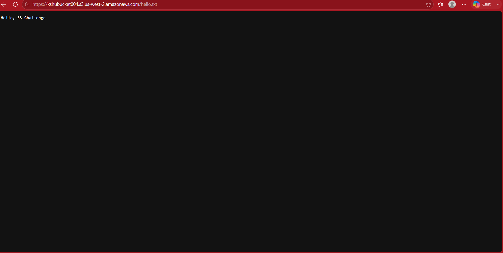
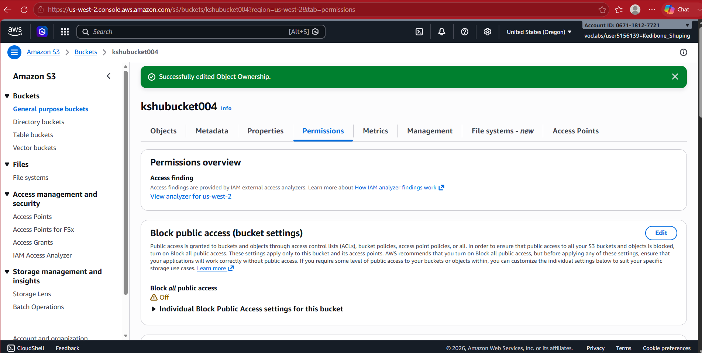

# Amazon S3: Public Object Access

## Overview

This challenge focused on creating an Amazon S3 bucket, uploading an object, and making the **object** publicly accessible without making the entire bucket public.

The interesting part was figuring out why the first attempt to apply a public ACL failed, then working through the S3 access settings until the object could be reached through a browser.

## What I Built

I created an S3 bucket and uploaded `hello.txt` using the AWS CLI from a Linux CLI host.

The goal was to make the object available through its public URL while keeping the distinction between **bucket-level access** and **object-level access** clear.

The workflow was:

1. Configured the AWS CLI for `us-west-2`.
2. Created the S3 bucket.
3. Uploaded `hello.txt`.
4. Tried to access the object through a browser.
5. Attempted to apply a `public-read` ACL.
6. Investigated the permission error.
7. Adjusted the bucket's Block Public Access and Object Ownership settings so the ACL workflow could be used.
8. Applied the `public-read` ACL to the object.
9. Verified the object through its public URL.
10. Listed the bucket contents from the CLI.

## Troubleshooting

The first attempt to apply the public ACL failed because S3 Block Public Access was preventing the ACL from being used.

This was a useful failure because it showed that making an S3 object public is not controlled by a single setting. I had to look at the bucket's public-access configuration and Object Ownership settings before the object-level ACL could be applied.

The important distinction was:

```text
Block Public Access
        |
        v
Can prevent public ACLs from being used
        |
        v
Object Ownership
        |
        v
Determines whether the ACL-based workflow is available
        |
        v
public-read ACL on the object
        |
        v
Object accessible through its public URL
```

Turning off the relevant Block Public Access setting did not automatically make the object public. The object still needed an explicit permission.

## Key Commands

```bash
aws configure
aws s3 mb s3://<bucket-name> --region us-west-2
aws s3 cp hello.txt s3://<bucket-name>/
aws s3api put-object-acl --bucket <bucket-name> --key hello.txt --acl public-read
aws s3 ls s3://<bucket-name>/
```

## Screenshots

### Bucket Creation

The S3 bucket was created and the object was uploaded from the CLI host.



### ACL Permission Error

The first attempt to apply `public-read` failed, which led to investigating the bucket's public-access and Object Ownership settings.



### Bucket Contents

The bucket contents were verified using the AWS CLI.



### Public Object Access

After the access settings were adjusted and the ACL applied, the object could be opened through its public URL.



### Updated Permissions

The final configuration showed the bucket settings required for the object-level ACL workflow.



## Skills Demonstrated

- Created and managed an S3 bucket
- Used the AWS CLI to work with S3
- Uploaded and listed objects
- Worked with S3 object permissions and ACLs
- Configured Block Public Access and Object Ownership
- Troubleshot an S3 permission error
- Verified cloud resources through both the CLI and a web browser

## Key Lessons Learned

The most useful part of this challenge was the permission failure. It forced me to look beyond the command itself and understand the different layers involved in S3 public access.

It also reinforced an important troubleshooting habit: when a command fails, the command is not necessarily the problem. The surrounding resource configuration can determine whether an otherwise valid operation is allowed.
