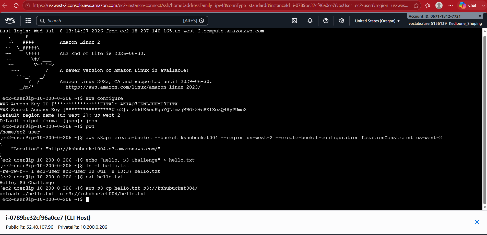

# Challenge Lab: Create Amazon S3 Bucket

## Project Overview

This project demonstrates how to create an Amazon S3 bucket using the AWS CLI, upload an object, and configure it for public access.

During this lab, I created an S3 bucket (`kshubucket004`), uploaded a sample text file (`hello.txt`), configured the required permissions, and successfully accessed the object through a public URL in a web browser.

---

## AWS Services Used

### Amazon S3
- Stored the bucket and uploaded object.
- Hosted the publicly accessible file.

### AWS CLI
- Created the S3 bucket.
- Uploaded the object.
- Managed bucket permissions.
- Verified bucket contents.

---

## Architecture

```text
User
│
▼
AWS CLI (EC2 Instance)
│
▼
Amazon S3 Bucket (kshubucket004)
│
▼
Public Object (hello.txt)
│
▼
Public URL
│
▼
End User Browser
```

---

## Project Workflow

1. Created an Amazon S3 bucket with a globally unique name.
2. Created a sample text file (`hello.txt`).
3. Uploaded the file to the S3 bucket using the AWS CLI.
4. Attempted to make the object publicly accessible.
5. Resolved the permission error by disabling **Block Public Access**.
6. Changed **Object Ownership** to **Bucket owner preferred**.
7. Successfully applied a public-read ACL to the object.
8. Verified the object was publicly accessible through its public URL.
9. Listed bucket contents using the AWS CLI to confirm the upload.

---

## Skills Demonstrated

- Amazon S3 bucket creation
- AWS CLI fundamentals
- Object uploads
- Bucket permission management
- Public object access
- Understanding Block Public Access
- Working with Access Control Lists (ACLs)
- Troubleshooting permission errors

---

## Screenshots

### 1. Bucket Creation via AWS CLI



Successfully created the Amazon S3 bucket using the AWS CLI.

---

### 2. ACL Permission Error


The `put-object-acl` command initially failed because Block Public Access was enabled.

---

### 3. Bucket Verification


Verified that the bucket was successfully created by listing all available S3 buckets.

---

### 4. Public URL Verification


Confirmed that the uploaded object could be accessed successfully through its public URL.

---

### 5. Updated Bucket Permissions


Modified the bucket settings by disabling Block Public Access and enabling ACL support through Object Ownership settings.

---

## Challenges Encountered

The `put-object-acl` command initially failed because **Block Public Access** prevented public ACLs from being applied.

To resolve the issue, I:

- Disabled **Block Public Access**.
- Changed **Object Ownership** to **Bucket owner preferred**.
- Re-ran the AWS CLI command successfully.

This demonstrated how S3 security settings interact with Access Control Lists (ACLs).

---

## What I Learned

Through this lab, I learned how to:

- Create and manage Amazon S3 buckets using the AWS CLI.
- Upload objects to Amazon S3.
- Configure public access securely.
- Understand the relationship between Block Public Access and ACLs.
- Troubleshoot common S3 permission issues.
- Verify uploaded objects using both the AWS CLI and a web browser.
